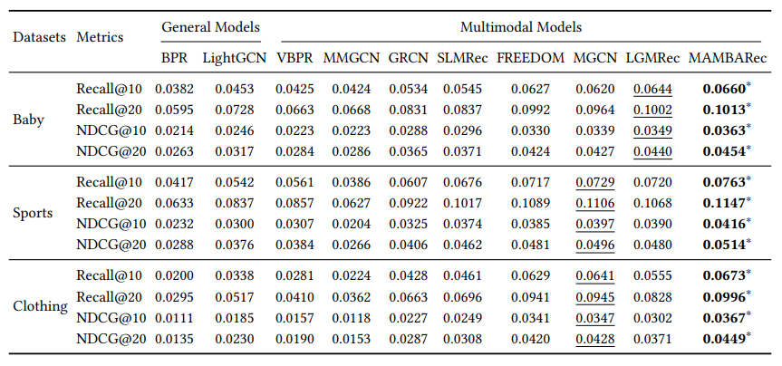

# MambaRec — Multimodal Recommendation System

Implementation of **MambaRec**, a multimodal recommendation framework that combines user–item interactions with textual and visual item features for personalized Top-K recommendation.

[](https://pytorch.org/)
[](https://www.cikm2025.org/)
[](https://arxiv.org/abs/2509.09114)

## Overview

This repository implements the architecture proposed in:

> **Kelin Ren, Chan-Yang Ju, and Dong-Ho Lee (2025).**
> *Modality Alignment with Multi-scale Bilateral Attention for Multimodal Recommendation.*
> **CIKM 2025**

The implementation combines:

* **Graph-based collaborative filtering** for user–item interactions
* **Textual and visual item representations**
* **DREAM multi-scale bilateral attention** for multimodal feature refinement
* **BPR loss** for recommendation optimization
* **InfoNCE contrastive learning** for cross-modal alignment
* **MMD loss** for distribution-level modality alignment


## Dataset

The experiments use multimodal recommendation datasets containing:

* User–item interaction data
* Precomputed **text features** extracted using Sentence Transformers
* Precomputed **image features** extracted using CNN-based models

Supported datasets:

* **Baby**
* **Sports**
* **Clothing**

Dataset files can be obtained from the original project resources.

## Environment

* Python 3.8
* PyTorch 1.11.0
* CUDA 11.3
* Ubuntu 20.04

## Running the Model

Place the downloaded dataset inside the `data` directory.

Then enter the `src` directory and run:

```bash
python main.py -m MambaRec -d baby
```

The model and dataset configurations can be modified through:

```text
configs/model/MambaRec.yaml
configs/dataset/*.yaml
```

Replace `baby` with `sports` or `clothing` to run the corresponding dataset.

## Evaluation

The model evaluates personalized Top-K recommendation performance using:

* **Recall@K**
* **NDCG@K**
* **Precision@K**
* **MAP@K**

The implementation follows the experimental setup described in the original CIKM 2025 paper.



## Reference

```text
Kelin Ren, Chan-Yang Ju, and Dong-Ho Lee.
"Modality Alignment with Multi-scale Bilateral Attention for
Multimodal Recommendation."
CIKM 2025.
```

Paper: https://arxiv.org/abs/2509.09114

## Implementation Note

This repository is an implementation/reproduction of the MambaRec research work.
The original method and research contribution belong to the authors cited above.

## Acknowledgements

The project structure is inspired by the [MMRec](https://github.com/enoche/MMRec) framework. We acknowledge their contribution to the development of the multimodal recommendation research ecosystem.
